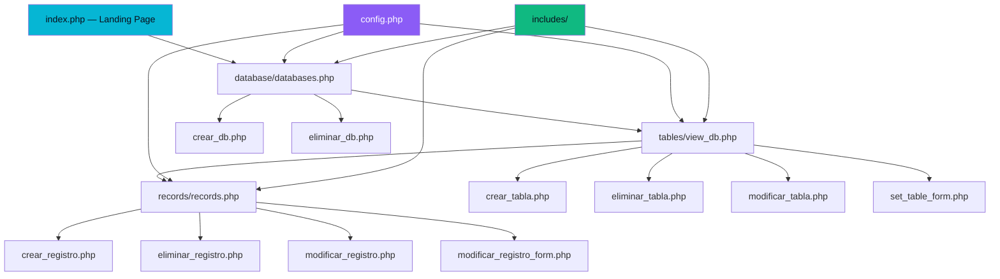

# 🔷 DataForge CRUD Manager

[](https://php.net)
[](https://mysql.com)
[](LICENSE)
[]()

**DataForge** es un sistema profesional de gestión de bases de datos MySQL construido en PHP nativo. El proyecto fue desarrollado para resolver la necesidad de estructurar, visualizar y manipular datos relacionales (operaciones CRUD) mediante una interfaz web accesible, fuertemente tipada y segura por defecto.

---

## ✨ Características Técnicas

| Módulo | Especificación |
|---------|-------------|
| 🗄️ **Bases de Datos** | Motor de creación, listado y eliminación segura de bases de datos MySQL. |
| 📊 **Diseñador de Tablas** | Constructor visual de esquemas relacionales con soporte estricto para 8+ tipos de datos (INT, VARCHAR, TEXT, DATE, BOOLEAN, etc.). |
| 📝 **Gestión de Registros** | Formularios dinámicos auto-generados para operaciones Create, Read, Update, Delete (CRUD). |
| 🔒 **Capa de Seguridad** | Tolerancia cero a vulnerabilidades: Tokens CSRF en cada mutación, Prepared Statements obligatorios, sanitización de inputs (XSS) y operaciones destructivas forzadas vía POST. |
| 🌙 **Interfaz de Usuario** | Design System propio basado en propiedades CSS con "Glassmorphism", reduciendo la fatiga visual del administrador mediante un tema oscuro de alto contraste. |
| ⚡ **Notificaciones Asíncronas** | Sistema de mensajes Flash en sesión (Toast notifications) para feedback no bloqueante. |
| 🏗️ **Arquitectura** | Implementación del patrón Action-Domain-Responder (ADR) apoyado por un sistema modular de templates PHP. |

---

## 🏛️ Arquitectura de Software

La arquitectura detallada y el razonamiento detrás de las decisiones técnicas (ADR, mitigación CSRF, Inyección SQL) se encuentran documentados en el archivo [ARCHITECTURE.md](docs/ARCHITECTURE.md).



---

## 📁 Estructura del Proyecto

```
dataforge/
├── config.php               # Singleton de configuración (.env loader)
├── .env.example             # Plantilla de variables de entorno
├── .gitignore               # Reglas de exclusión de control de versiones
├── index.php                # Vista principal (Landing page)
├── sobre_nosotros.php       # Vista de información corporativa
├── documentacion.php        # Generador de manual técnico en versión imprimible
├── style.css                # Design system unificado (variables CSS)
│
├── includes/                # Templates compartidos (DRY)
│   ├── header.php           # DOM estructurado + navegación
│   ├── footer.php           # Pie de página base
│   ├── csrf.php             # Motor criptográfico para tokens de sesión
│   └── flash.php            # Buffer de notificaciones asíncronas
│
├── database/                # Dominio: Servidor MySQL
│   ├── db_functions.php     # Interacciones SQL nativas
│   ├── databases.php        # Vista: Listado de bases de datos
│   ├── crear_db.php         # Handler: Acción Create
│   └── eliminar_db.php      # Handler: Acción Delete (POST estricto)
│
├── tables/                  # Dominio: Esquemas de tablas
│   ├── table_functions.php  # Lógica de manipulación estructural
│   ├── view_db.php          # Vista: Explorador de tablas
│   ├── crear_tabla.php      # Handler: Acción Create
│   ├── crear_tabla_from_db.php # Interfaz del constructor visual
│   ├── eliminar_tabla.php   # Handler: Acción Delete
│   ├── modificar_tabla.php  # Handler: Mutación estructural
│   └── set_table_form.php   # Interfaz de mutación
│
├── records/                 # Dominio: Mutación de datos (CRUD)
│   ├── record_functions.php # Ejecución de Prepared Statements
│   ├── records.php          # Vista: Tablero de datos
│   ├── crear_registro.php   # Handler: Inserción de entidad
│   ├── eliminar_registro.php    # Handler: Eliminación física
│   ├── modificar_registro.php   # Handler: Actualización de entidad
│   └── modificar_registro_form.php  # Formulario dinámico pre-poblado
│
├── img/                     # Repositorio de assets estáticos
├── docs/                    # Repositorio de especificaciones técnicas
│   └── ARCHITECTURE.md      # Registro de Decisiones Arquitectónicas (ADR)
└── README.md                # Raíz de documentación técnica
```

---

## 🚀 Despliegue en Entorno Local

### Requisitos del Sistema

- **Motor Backend:** PHP 8.0+
- **Motor de Base de Datos:** MySQL 5.7+ / MariaDB 10.4+
- **Servidor Web:** Apache 2.4+ (requiere `mod_rewrite`)
- **Entornos Recomendados:** XAMPP, LAMP, MAMP o WAMP.

### Instrucciones de Instalación

1. **Clonar el repositorio y ubicarlo en el servidor:**
```bash
git clone https://github.com/JuanCarlosBarronLopez/DataForge.git
cp -r DataForge /opt/lampp/htdocs/dataforge
```

2. **Inyectar la configuración del entorno:**
```bash
cd /opt/lampp/htdocs/dataforge
cp .env.example .env
nano .env # Asegúrate de colocar las credenciales exactas de tu servidor MySQL local
```

3. **Parámetros del `.env`:**
```ini
DB_HOST=localhost
DB_PORT=3306
DB_USER=root
DB_PASS=tu_contraseña_secreta
DB_CHARSET=utf8mb4

APP_ENV=development
APP_DEBUG=true
```

4. **Ejecución:**
Inicia los servicios de Apache y MySQL desde el panel de control de tu entorno (ej. XAMPP) y navega hacia `http://localhost/dataforge/index.php`.

---

## 🔒 Postura de Seguridad

Este proyecto fue estructurado bajo la filosofía de "Validar Siempre, Confiar Nunca". No existen variables superglobales expuestas directamente en la vista.

- **Defensa contra CSRF** — Inyección y validación de tokens de corta vida útil.
- **Defensa contra SQLi** — Mitigación vía parámetros bindeados (`stmt->bind_param`). Validaciones estrictas por _regex whitelist_ cuando el identificador no soporta bind.
- **Defensa contra XSS** — Neutralización de etiquetas estáticas usando `htmlspecialchars()`.
- **Inmutabilidad en el Código** — Cero credenciales presentes físicamente en la carpeta de distribución lógica. Dependencia exclusiva del archivo `.env`.
- **Cierre de Brecha Predictiva** — Bases de datos del sistema MySQL (`information_schema`, `mysql`, `performance_schema`) están protegidas de fábrica en la capa lógica para evitar colapsos inducidos.

---

## 🛠️ Stack y Herramientas

| Tecnología | Rol Arquitectónico |
|------------|------------------|
| **PHP 8+** | Ejecución de lógica de negocio, validaciones y renderizado de templates (Server-Side). |
| **MySQL (mysqli)** | Almacenamiento persistente e integridad relacional. |
| **HTML5 / CSS3** | Semántica de la capa visual y control de hoja de estilos modular (CSS Variables). |
| **Vanilla JS** | Micro-interacciones del DOM, control responsivo del "hamburger menu" y alertas del sistema. |

---

## 👥 Equipo de Arquitectura

**Raju Technology** — Desarrolladores especializados en la construcción de infraestructuras limpias, modulares y de alto rendimiento.

<p align="center">
  Construido por ingenieros de <strong>Raju Technology</strong>.
</p>
