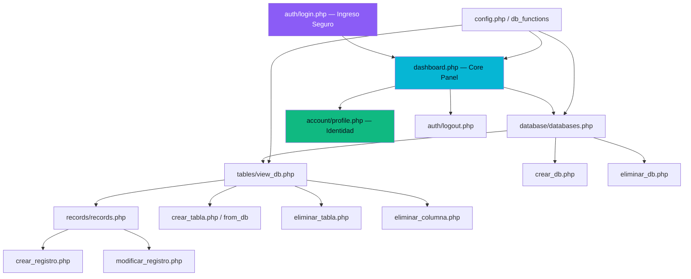

# 🔷 DataForge CRUD Manager v3.1

[](https://php.net)
[](https://mysql.com)
[](LICENSE)
[]()

**DataForge** ha evolucionado en su versión 3.1. Ya no es solo un gestor aislado, sino un **Ecosistema Multi-Usuario** altamente dinámico y profesional. Diseñado en PHP nativo, permite la manipulación relacional de bases de datos mediante identidades fortificadas, una estética visual inmersiva ("Glassmorphism" con 7 temas adaptables), y módulos completos de inyección de datos de prueba, manteniendo en todo rincón una tolerancia cero a fallas de seguridad.

---

## ✨ Características Técnicas (Novedades v3.1)

| Módulo | Especificación Técnica |
|---------|-------------|
| 🔐 **Identidad Fuerte** | Sistema de Onboarding en `/auth/` blindado por `PASSWORD_BCRYPT`. Toda operación en bases de datos requiere validación por `requireLogin()` y tokens CSRF activos por cada vista. |
| 🏰 **Migraciones Automáticas** | Se auto-instala la base de datos `dataforge_system` de forma imperceptible, albergando en ella la bóveda de usuarios, variables de entorno como los temas gráficos, y el log central de auditoría. |
| 🎨 **7 Temas Industriales** | Interfaz adaptada a diferentes industrias operativas *(Tech Dark, MediCare, FoodPro, IronForge, LexDesk, EduBase, ShopFlow)*. Los estilos CSS inyectan color y ambiente dinámicamente sobre todo el DOM. |
| 🌗 **Motor Light / Dark Mode** | Soporte híbrido. Botonera en el Panel de Perfil inyecta la clase general `mode-light` logrando esquemas visuales en alto contraste (Soft-White mode) ideal para el trabajo diurno. |
| 📸 **Avatares Interactivos** | Gestión nativa para la subida de fotografías JPG/PNG. Incluye Live-Preview asíncrono con JavaScript mediante `FileReader`, recorte geométrico integrado CSS, y renombramiento seguro vía Hashes `MD5`. |
| 🗄️ **Bases de Datos Isoladas** | Motor subyacente para la manipulación y destrucción de bases de datos MySQL, protegidos por Zonas de Peligro nativas. |
| 📊 **Diseñador DB** | Constructor visual de esquemas relacionales sin necesidad de comandos. Soporte estricto por menús de persiana para todos los tipos de datos nativos (INT, VARCHAR, TEXT, BOOLEAN, DATE, etc.). |
| 🎯 **Conteo Matemático Exacto** | El panel de Dashboard migró su arquitectura de estimación por `information_schema` hacia un cálculo bruto garantizado por lecturas `SELECT COUNT(*)` exactas para cada iteración de tabla visible. |
| 🧪 **Módulo de Data Injections** | Integra una semilla automatizada (`inyeccion_datos.php`) encargada de inyectar 3 tablas locales y métricas artificiales para poblar los Dashboards y poner a prueba los estreses del frontend sin quebrar sistemas reales de usuario. |

---

## 🏛️ Arquitectura de Software

La arquitectura de ruteos internos detona siempre desde el Controlador (`index.php`) o los páneles de Auth. Utiliza fundamentos del patrón *Action-Domain-Responder (ADR)* evitando inyectar lógica de negocio en componentes visuales.



---

## 📁 Estructura Completa del Proyecto

```
dataforge/
├── config.php               # Singleton de configuración (.env loader)
├── .env.example             # Plantilla de variables de entorno estático
├── dashboard.php            # Panel principal Post-Login
├── index.php                # Receptor (Landing route)
├── documentacion.php        # Manuales de integración de la plataforma
├── inyeccion_datos.php      # [NUEVO] Seeder de Mock-Data local.
├── sobre_nosotros.php       # Información de Equipo y Branding.
├── themes.css / style.css   # [UPDATE] Design System dinámico con mutaciones visuales
│
├── account/                 # Dominio: Datos de Usuario y UX
│   ├── profile.php          # Frontend Interactivo (Avatares, Light Switches)
│   ├── update_profile.php   # Interceptor Hasheador de Fotografías de perfil
│   └── delete_account.php   # Sistema Purga de cuenta (Danger Zone)
│
├── auth/                    # Dominio: Middleware & Security Core
│   ├── auth_functions.php   # Rutinas de BCRYPT y Migración Automática de Tablas
│   ├── login.php / logout.php # Portal de acceso de cuentas
│   └── onboarding.php       # Frontend visual para inyectar industria y preferencias
│
├── includes/                # Templates y Micro-Componentes DRy
│   ├── header.php           # Inyecta los "CSS Modes" dinámicamente al DOM visual global
│   ├── footer.php           # Scripts globales anexos (Cierres de HTML)
│   ├── flash.php            # Enrutador asíncrono de Toast Notifications elegantes
│   └── csrf.php             # Constructor de semilas para mitigar ataques falsificados
│
├── database/, tables/, records/  # Dominio Original CRUD (Constructores y Operaciones)
│
└── uploads/                 # Storage
    └── avatars/             # Persistencia física de imágenes subidas por los usuarios.
```

---

## 🚀 Despliegue en Entorno Local

### Requisitos Mínimos
- Entorno: Apache 2.4+ (Con `mod_rewrite` si aplica parametrización).
- Backend Exec: **PHP 8.0+**
- DB Server: MySQL 5.7+ / MariaDB 10.4+  *(Ej. nativos de XAMPP / MAMP).*

### Instalación a Prueba de Balas

1. **Clonar e inyectar al servidor local:**
```bash
git clone https://github.com/JuanCarlosBarronLopez/DataForge.git
cp -r DataForge C:/xampp/htdocs/dataforge_v3
```

2. **Copiar credenciales de entorno:**
```bash
cd C:/xampp/htdocs/dataforge_v3
cp .env.example .env
```

3. **Inyectar credenciales (en `.env`):**
Abre tu `.env` e impone las bases de tu servidor. No expongas este archivo a GitHub.
```ini
DB_HOST=localhosto_ip
DB_USER=tu_usuario_db
DB_PASS=tu_password_db
```

4. **Encendido Automático:**
Navega vía navegador a `http://localhost/dataforge_v3/` y haz clic en "Crear Cuenta". 
> **La Magia Pasa por Debajo**: Date de Alta y de forma invisible se lanzará el generador nativo que levantará la base secreta de `dataforge_system` para ti.

5. **Poblar Métricas Pruebas (Opcional):**
Navega localmente por url a `http://localhost/dataforge_v3/inyeccion_datos.php`. Al correrla una sola vez, este autómata creará y llenará 3 bases de datos colosales de relleno para que el panel luzca exactamente como la demo oficial y puedas hacerle CRUD-Testing desde el minuto uno.

---

## 🔒 Estándares y Muros de Seguridad Transversal

El protocolo del ecosistema en DataForge dictamina que *"Validar Siempre y No Confiar Nunca"* es la única verdad:

- **Tokens Descartables (CSRF):** Cualquier inyección que pueda escribir bases o borrar registros debe adjuntar un token numérico impreso en las sombras que solo existe por 1 segundo hasta que la sesión muere.
- **Parametrización Defensiva (Prepared Statements):** El 100% de los controladores (`record_functions.php` y anexos) emplean `stmt->bind_param` cortando de tajo violaciones o brechas de "Inyección SQL` clásicas de la vieja escuela PHP.
- **Neutralización XSS Front-End:** Bloqueo de ejecuciones dinámicas mediante parseo directo al inyectar elementos visuales sobre los `<tables>` y `href` en las variables de escape usando `htmlspecialchars()`.
- **Cierre Predictivo Mutante:** Funciona sin comandos manuales. Si te mueves entre branches desactualizadas o la DataBase se desfasa, sus funciones como `installSystemDb()` realizan un chequeo asíncrono y reconstruyen variables nulas / inyectan columnas olvidadas automáticas en tu MySQL de forma reactiva.

---

## 👥 Equipo de Arquitectura Científica

La creación y mantenimiento de ecosistemas limpios, modulares y de alto rendimiento.

<p align="center">
  Construido por ingenieros de vanguardia en <strong>Raju Technology</strong>. <br> "Diseccionando el ruido transaccional a través de infraestructuras vítreas de frontera".
</p>
