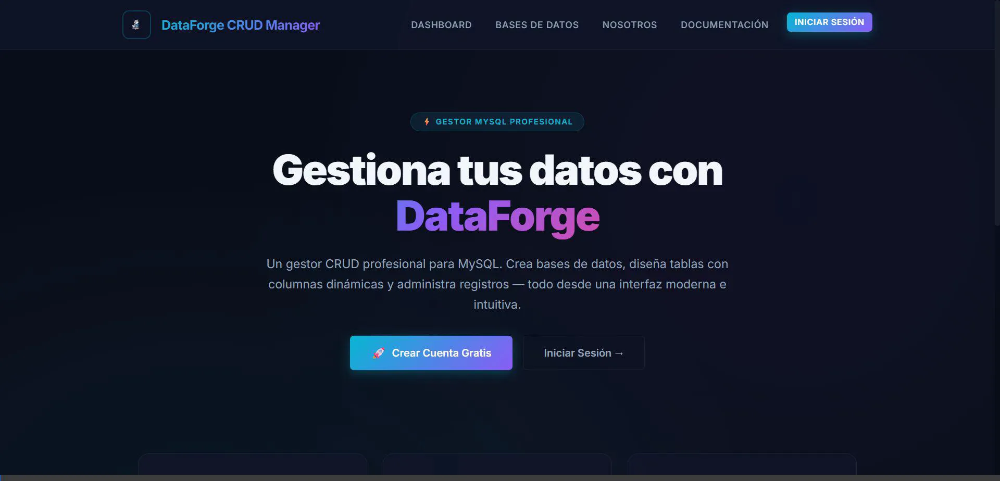
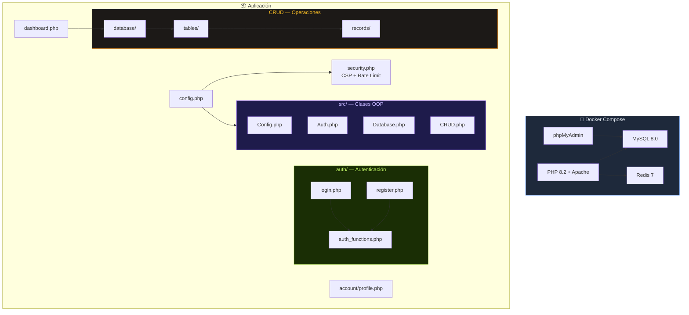
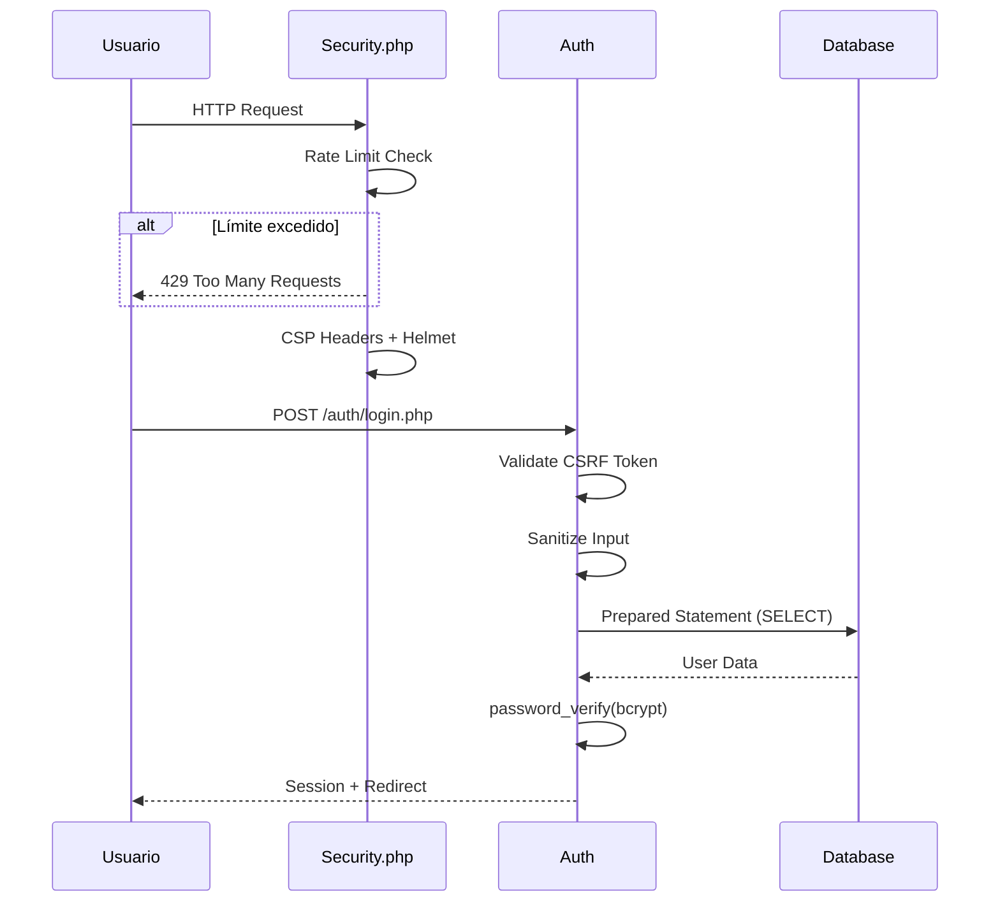

# 🔷 DataForge CRUD Manager v3.2

[](https://php.net)
[](https://mysql.com)
[](https://docker.com)
[](https://phpunit.de)
[](LICENSE)
[](https://render.com)
[]()

**DataForge** es un **ecosistema multi-usuario** profesional para la gestión completa de bases de datos MySQL. Construido en PHP nativo (sin frameworks), demuestra dominio de fundamentos: arquitectura modular, seguridad multicapa, dockerización completa, y testing automatizado.

> 🌐 **Demo en vivo:** [dataforge.onrender.com](https://dataforge.onrender.com) *(Configura tu URL aquí)*

---

## 🖼️ Interfaz & Temas

DataForge incluye 7 temas visuales adaptados a diferentes industrias, todos con soporte para modo claro y oscuro. 



| Tema | Industria | Preview |
|------|-----------|---------|
| 💻 **Tech Dark** | Tecnología & Desarrollo | Tema por defecto — Tonos cyan/violeta sobre fondo oscuro |
| 🏥 **MediCare** | Salud & Medicina | Paleta de verdes suaves y blancos clínicos |
| 🍽️ **FoodPro** | Restaurantes & Alimentos | Naranjas cálidos y tonos terrosos |
| 🔧 **IronForge** | Ferretería & Construcción | Amarillos industriales y grises metálicos |
| ⚖️ **LexDesk** | Servicios Legales | Azules formales y dorados sobrios |
| 🎓 **EduBase** | Educación & Escuelas | Verdes académicos y azules institucionales |
| 🛍️ **ShopFlow** | Retail & Comercio | Rosas vibrantes y violetas comerciales |

---

## ✨ Características Técnicas

| Módulo | Especificación |
|--------|---------------|
| 🔐 **Autenticación** | Registro/login blindado por `PASSWORD_BCRYPT` (cost 12). Tokens CSRF por vista. Session cookies con `SameSite=Strict`, `HttpOnly`, `Secure`. |
| 🏰 **Auto-Migración** | Base `dataforge_system` se crea automáticamente al primer registro. Upgrade scripts reactivos detectan y añaden columnas faltantes. |
| 🎨 **7 Temas** | Glassmorphism + CSS Variables. Inyección dinámica de tema al DOM. Soporte Light/Dark mode. |
| 🗄️ **Gestión DB** | Crear, listar, eliminar bases de datos MySQL. Protección contra eliminación de DBs del sistema. |
| 📊 **Diseñador de Tablas** | Constructor visual con soporte para INT, VARCHAR, DECIMAL, TEXT, DATE, DATETIME, BOOLEAN. |
| 📝 **CRUD Completo** | Formularios dinámicos auto-generados. Prepared statements al 100%. Paginación. |
| 📸 **Avatares** | Upload con preview async (FileReader). Renombramiento seguro via MD5. Validación de extensión. |
| 🧪 **Data Seeder** | Módulo de inyección de datos de prueba para poblar dashboards. |
| 🐳 **Docker** | Dockerfile + Compose con PHP, MySQL, phpMyAdmin, Redis. Soporte para Render/Railway. |
| 🧪 **Tests** | PHPUnit con suites para Auth, CRUD, y Seguridad. |

---

## 🏛️ Arquitectura



### Flujo de Seguridad



---

## 🚀 Instalación Rápida (Docker)

### Requisitos
- [Docker Desktop](https://docker.com/get-started) instalado y corriendo.

### 3 comandos para empezar:

```bash
# 1. Clonar el repositorio
git clone https://github.com/JuanCarlosBarronLopez/DataForge.git
cd DataForge

# 2. Configurar variables de entorno
cp .env.example .env

# 3. Levantar todo
docker compose up -d --build
```

**¡Listo!** Abre tu navegador:
- 🌐 **DataForge:** [http://localhost:8080](http://localhost:8080)
- 🗄️ **phpMyAdmin:** [http://localhost:8081](http://localhost:8081)

### Servicios incluidos

| Servicio | Puerto | Descripción |
|----------|--------|-------------|
| DataForge App | `8080` | Aplicación PHP + Apache |
| MySQL 8.0 | `3307` | Base de datos (puerto externo) |
| phpMyAdmin | `8081` | Administrador visual de MySQL |
| Redis 7 | `6380` | Rate limiting & caché |

---

## 🖥️ Instalación Legacy (XAMPP)

Si prefieres el entorno tradicional sin Docker:

1. **Requisitos:** Apache 2.4+, PHP 8.0+, MySQL 5.7+
2. **Clonar al htdocs:**
```bash
git clone https://github.com/JuanCarlosBarronLopez/DataForge.git
cp -r DataForge C:/xampp/htdocs/dataforge
cd C:/xampp/htdocs/dataforge
cp .env.example .env
```
3. **Editar `.env`** con tus credenciales de MySQL
4. **Abrir** `http://localhost/dataforge/` y crear una cuenta

---

## ☁️ Deploy en Render (Producción)

### Paso 1 — Base de datos MySQL externa (TiDB Cloud)

DataForge necesita una base de datos MySQL. Render no ofrece MySQL en su free tier, así que usamos **TiDB Cloud** (gratuito):

1. Crea cuenta en [tidbcloud.com](https://tidbcloud.com)
2. Crea un cluster **Serverless** (gratuito)
3. Obtén las credenciales de conexión:
   - Host: `gateway01.xx.tidbcloud.com`
   - Puerto: `4000`
   - Usuario: `xxxxx.root`
   - Password: `tu_password`
   - Database: `dataforge_system`

### Paso 2 — Deploy en Render

1. Crea cuenta en [render.com](https://render.com)
2. **New → Blueprint** → Conecta tu repositorio GitHub
3. Render detectará el `render.yaml` automáticamente
4. En el dashboard de Render, configura las variables de entorno:

```
DB_HOST=gateway01.xx.tidbcloud.com
DB_PORT=4000
DB_USER=xxxxx.root
DB_PASS=tu_password_tidb
SYSTEM_DB=dataforge_system
```

5. Deploy automático al hacer push a `main`

### Paso 3 — Verificar

- Tu app estará en `https://dataforge.onrender.com`
- El primer acceso puede tardar ~30s (cold start del free tier)

> ⚠️ **Nota:** Los archivos subidos (avatares) se pierden en cada redeploy del free tier. Para producción real, usar almacenamiento externo (S3, Cloudinary).

---

## 🔒 Seguridad

DataForge implementa **7 capas de seguridad** transversal:

### 1. Tokens CSRF
Cada formulario inyecta un token criptográfico (`random_bytes(32)`) que se valida con `hash_equals()` y se invalida después de cada uso.

### 2. Prepared Statements (100%)
Todas las operaciones de datos usan `$stmt->bind_param()`. Los nombres de tablas/databases se validan con regex (`/^[a-zA-Z0-9_]+$/`) + `real_escape_string()`.

### 3. Password Hashing
`PASSWORD_BCRYPT` con cost 12. Verificación con `password_verify()`. Nunca se almacena contraseña en texto plano ni en sesión.

### 4. Security Headers
```
X-Content-Type-Options: nosniff
X-Frame-Options: SAMEORIGIN
X-XSS-Protection: 1; mode=block
Referrer-Policy: strict-origin-when-cross-origin
Permissions-Policy: camera=(), microphone=(), geolocation=()
Strict-Transport-Security: max-age=31536000 (producción)
Content-Security-Policy: default-src 'self'; ...
X-Permitted-Cross-Domain-Policies: none
Cross-Origin-Opener-Policy: same-origin
```

### 5. Rate Limiting
- **Global:** 60 requests/minuto por IP
- **Login:** 5 intentos/5 minutos por IP
- Backend: File-based (default) o Redis (producción)
- Headers: `X-RateLimit-Limit`, `X-RateLimit-Remaining`
- Respuesta: `429 Too Many Requests` con `Retry-After`

### 6. Session Hardening
```php
session_set_cookie_params([
    'secure'   => true,   // Solo HTTPS
    'httponly'  => true,   // Sin acceso JS
    'samesite'  => 'Strict' // Anti-CSRF cookies
]);
```

### 7. Input Sanitization
Funciones centralizadas `sanitizeInput()`, `sanitizeArray()`, `sanitizeDbIdentifier()` con `htmlspecialchars()`, `strip_tags()`, y validación regex.

---

## 🧪 Tests

```bash
# Instalar dependencias de testing
composer install

# Ejecutar todos los tests
composer test

# Ejecutar con Docker (recomendado)
docker compose up -d
docker compose exec app vendor/bin/phpunit
```

### Suites de tests

| Suite | Archivo | Tests |
|-------|---------|-------|
| **Auth** | `tests/AuthTest.php` | Registro, login, CSRF, sesiones, hashing, temas |
| **CRUD** | `tests/CRUDTest.php` | Bases de datos, tablas, registros (Create/Read/Update/Delete) |
| **Security** | `tests/SecurityTest.php` | Sanitización, rate limiting, validación de identificadores |

---

## 📁 Estructura del Proyecto

```
dataforge/
├── 🐳 Dockerfile              # Imagen PHP 8.2 + Apache
├── 🐳 docker-compose.yml      # PHP + MySQL + phpMyAdmin + Redis
├── 🐳 docker/                 # Configs Docker (apache.conf, entrypoint.sh)
├── ☁️  render.yaml             # Blueprint para deploy en Render
│
├── ⚙️  config.php              # Configuración centralizada (.env loader)
├── 📄 .env.example             # Template de variables de entorno
│
├── 🏠 index.php                # Landing page
├── 📊 dashboard.php            # Panel principal post-login
├── 📖 documentacion.php        # Documentación integrada
├── 🧪 inyeccion_datos.php      # Seeder de datos de prueba
│
├── src/                        # 🏗️ Clases OOP (Refactor v3.2)
│   ├── autoload.php            # PSR-4 autoloader
│   ├── Config.php              # Gestión de configuración
│   ├── Auth.php                # Autenticación & sesiones
│   ├── Database.php            # Conexiones & gestión de DBs
│   └── CRUD.php                # Operaciones de tablas & registros
│
├── auth/                       # 🔐 Autenticación
│   ├── auth_functions.php      # Funciones core (bcrypt, migraciones)
│   ├── login.php / register.php
│   ├── onboarding.php          # Selección de tema inicial
│   └── logout.php
│
├── includes/                   # 🧩 Componentes compartidos
│   ├── header.php / footer.php # Templates HTML
│   ├── csrf.php                # Protección CSRF
│   ├── flash.php               # Toast notifications
│   └── security.php            # CSP + Rate Limiting + Sanitización
│
├── database/                   # 🗄️ Gestión de bases de datos
├── tables/                     # 📊 Gestión de tablas
├── records/                    # 📝 Gestión de registros
├── account/                    # 👤 Perfil de usuario
│
├── tests/                      # 🧪 PHPUnit tests
│   ├── AuthTest.php
│   ├── CRUDTest.php
│   └── SecurityTest.php
│
├── style.css / themes.css      # 🎨 Design system + 7 temas
└── img/                        # 🖼️ Assets estáticos
```

---

## 🛠️ Stack Tecnológico

| Capa | Tecnología |
|------|-----------|
| **Backend** | PHP 8.2 nativo (sin frameworks) |
| **Base de datos** | MySQL 8.0 |
| **Frontend** | HTML5, CSS3 (Glassmorphism), JavaScript vanilla |
| **Contenedores** | Docker + Docker Compose |
| **Testing** | PHPUnit 10 |
| **CI/CD** | Render (auto-deploy desde GitHub) |
| **Cache/Rate Limit** | Redis 7 (opcional, fallback a filesystem) |

---

## 📄 Licencia

Este proyecto está bajo la [Licencia MIT](LICENSE).

<p align="center">
  Construido por <strong>Raju Technology</strong>
</p>
